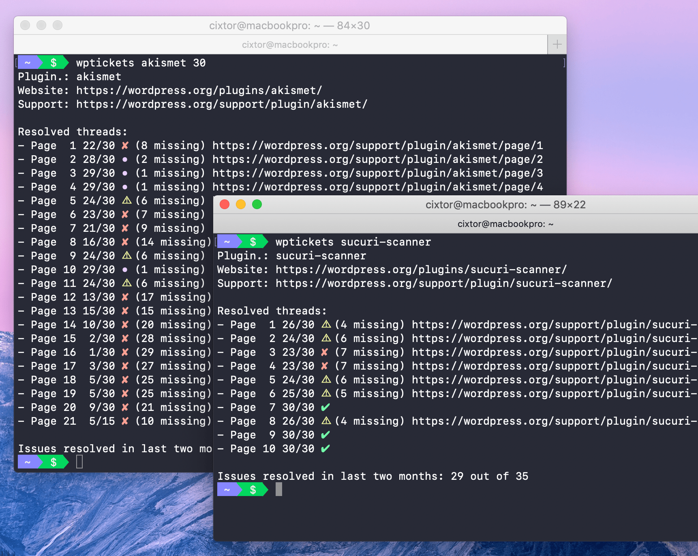

### WordPress Tickets

Visualize the status of multiple support requests for a WordPress plugin.

The [WordPress Support Forums](https://wordpress.org/support/) are a fantastic resource with a ton of information, but sometimes people have trouble getting help there and they don't know why. This is usually the result of a communication gap. The WordPress forums have one of the most helpful communities on the web, you just need to help them help you. Note: Please read the Supported Versions information as the the WordPress Support Forums only provide assistance for officially released versions of WordPress.

This tools sends HTTP requests to the latest twenty pages of the support page of the specified plugin, finds how many of the tickets are marked as resolved, and shows which ones are missing. Many people in the WordPress community sees the number of resolved tickets per month as a sign of responsiveness and promptness, other use this as one of the main reasons to install or not a plugin.

